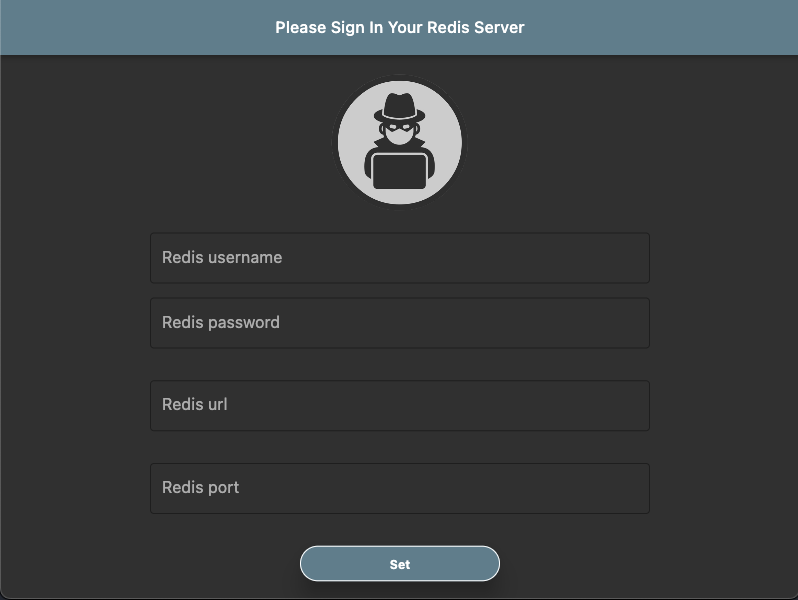
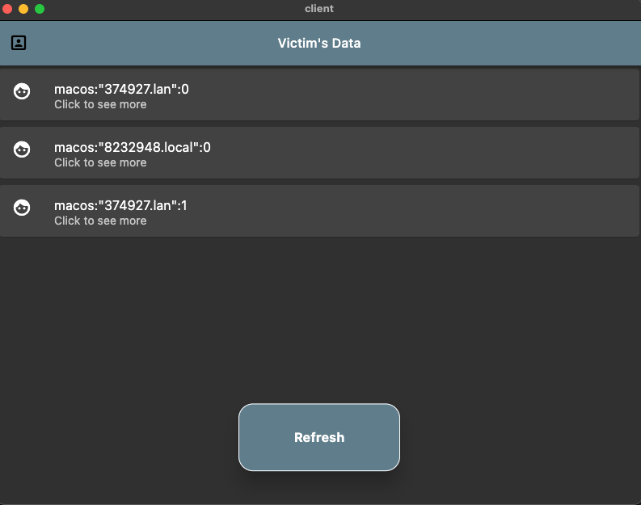
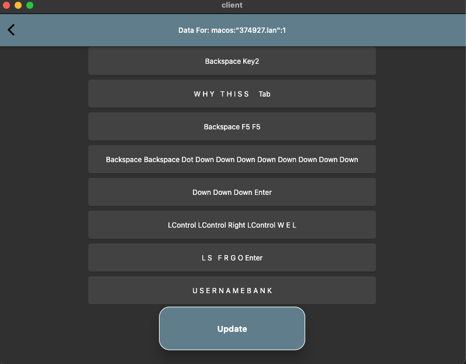
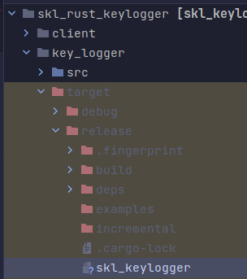
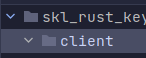

# Welcome To SKL!

## What are the features?

This Keylogger is fast and is undetected under most common antiviruses and is cross platform.
It also includes a client to sort and see your victims data like this

## How to use?

Compile the rust code with your redis key and make sure it is correct and make sure it is like this ``redis://[<username>][:<password>@]<hostname>[:port][/<db>]``
in key_logger/main.rs. For example

Next do 
``cargo build --release`` then go in 

you should see your exe(I'm on linux, so it is a binary)
## Client Setup (optional)

Go in 

then do ``flutter run --release`` or you can use some other redis client

